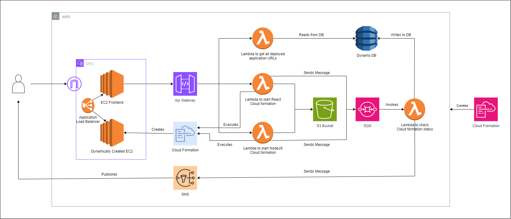

# AutoDeploy

This project provides a streamlined solution for deploying React and Node.js applications directly from GitHub repositories, even if it is private. The primary goal is to automate the deployment process, ensuring that your applications are up and running with minimal manual intervention.

## Features

- **Automated Deployment Process:** Easily deploy React (frontend) and Node.js (backend) applications by specifying their respective GitHub repository URLs. The project handles cloning the repositories, installing dependencies, and deploying the applications.
- **Environment Configuration:** Configure environment variables and deployment settings for both frontend and backend applications.

## Technologies Used

- Frontend: ReactJS
- Backend: Serverless (AWS Lambda)
- Database: DynamoDB
- Amazon Elastic Compute Cloud (EC2)
- AWS Simple Notification Service (SNS)
- AWS Simple Queue Service (SQS)
- AWS S3
- CloudFormation
- API Gateway
- Docker
- Git

## Architecture

